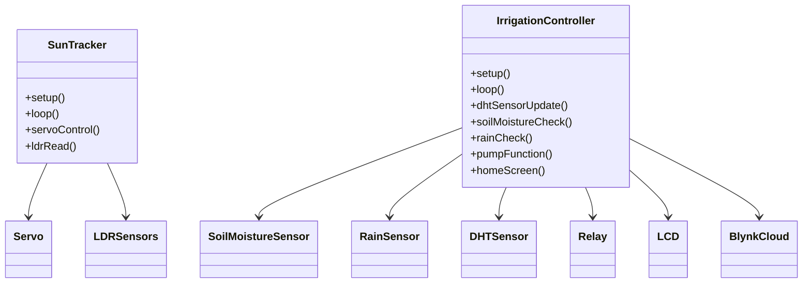
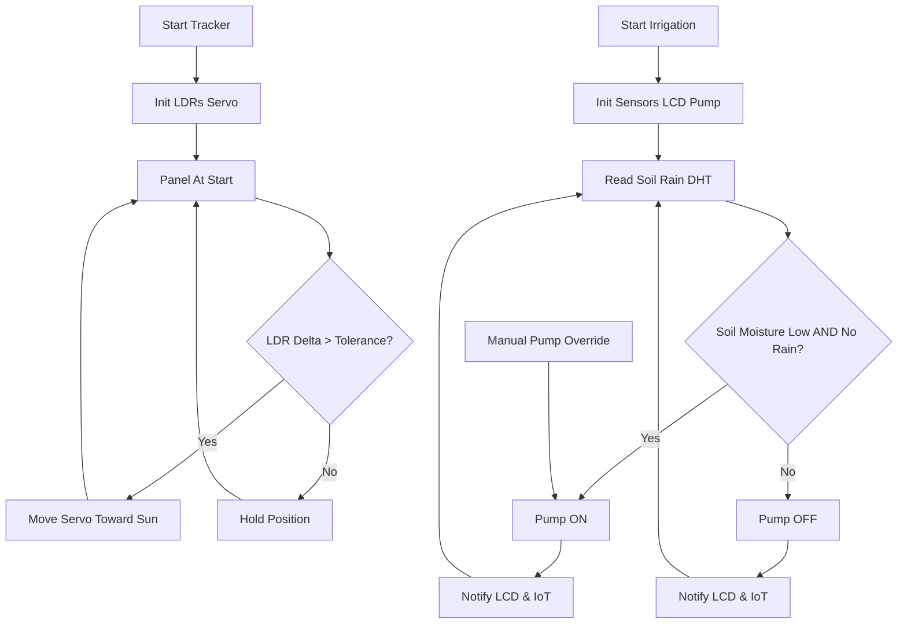
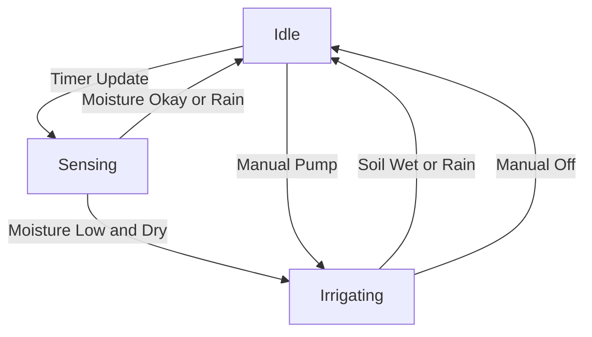

# Renewable Sun Tracker and Smart Irrigation Controller (ReSTIC)

## Abstract

This project unites dynamic solar tracking with intelligent irrigation control for energy-efficient, sustainable agriculture and off-grid automation. The **ReSTIC system** uses dual LDR sensors and a servo to maintain solar panel orientation for maximum sunlight. Its agriculture module features ESP8266 WiFi, soil moisture and rain detection, temperature/humidity sensing (DHT), and relay-based pump switching. Operations—including weather-based irrigation, manual override, and real-time notifications—are displayed on an LCD and managed via Blynk IoT cloud for full visibility and remote control. Ideal for renewable-powered gardens, smart greenhouses, and off-grid water automation.

---

## Hardware Components

- **Sun Tracker**
  - Arduino Nano/UNO
  - Servo motor (panel actuation)
  - 2x LDR sensors (East/West)
- **Smart Irrigation**
  - ESP8266 microcontroller
  - Soil moisture sensor
  - Rain sensor
  - DHT temp/humidity sensor
  - Relay module (for water pump)
  - 16x2 I2C LCD display
  - Power and wiring acc., Blynk IoT app

---

## Features

- **Sun Tracking:** Panel always faces most intense sunlight—boosts power capture
- **Auto-Irrigation:** Real-time soil moisture & rain sensing for optimized watering
- **Manual override:** Pump can be controlled via app
- **Live feedback:** LCD and Blynk app notifications/status
- **Minimal adjustment, water/energy savings**

---

## UML Class Diagram

---

## Flowchart

---

## State "Flowchart" 

---
