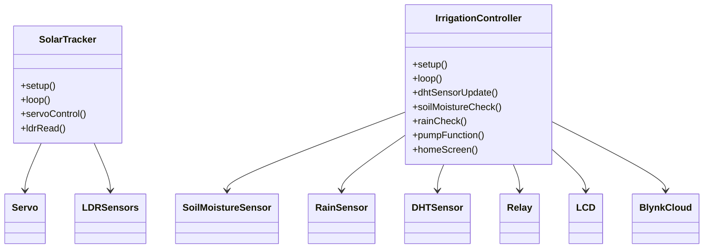
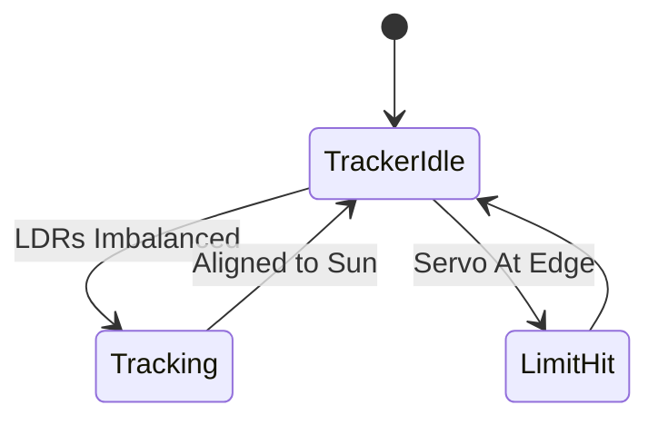

# Renewable Sun Tracker and Smart Irrigation Controller (ReSTIC)

## Abstract

This project unites dynamic solar tracking with intelligent irrigation control for energy-efficient, sustainable agriculture and off-grid automation. The **ReSTIC system** uses dual LDR sensors and a servo to maintain solar panel orientation for maximum sunlight. Its agriculture module features ESP8266 WiFi, soil moisture and rain detection, temperature/humidity sensing (DHT), and relay-based pump switching. Operations—including weather-based irrigation, manual override, and real-time notifications—are displayed on an LCD and managed via Blynk IoT cloud for full visibility and remote control. Ideal for renewable-powered gardens, smart greenhouses, and off-grid water automation.

---

## Hardware Components

- **Solar Tracker:**
  - Arduino Nano/UNO
  - Servo motor
  - LDR sensors (East, West)
- **Irrigation Controller:**
  - ESP8266 microcontroller
  - Soil moisture sensor
  - Rain sensor
  - DHT temperature/humidity sensor
  - Relay module (pump)
  - 16x2 I2C LCD

---


## Features

- Dynamic solar alignment for higher renewable power yield
- Soil moisture/rain-based irrigation automation
- DHT-driven climate sensing for crop comfort
- LCD and Blynk app for status and manual override
- Water/energy saving, remote management, error alarms

---

## UML Class Diagram



---

## Flowchart


---

## State Diagram



```mermaid
[*] --> IrrigationIdle
IrrigationIdle --> Sensing : Timer Update
Sensing --> Irrigate : Moisture Low, Rain False
Sensing --> IrrigationIdle : Moisture OK, Rain or Pump Off
Irrigate --> IrrigationIdle : Target Reached or Rain
IrrigationIdle --> ManualOverride : Pump Switch Used
ManualOverride --> Irrigate
ManualOverride --> IrrigationIdle

```

---
